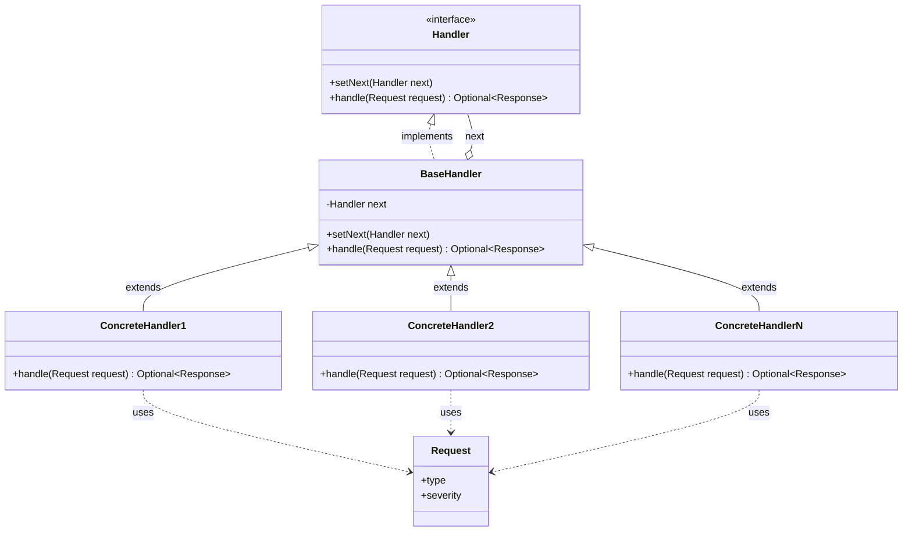
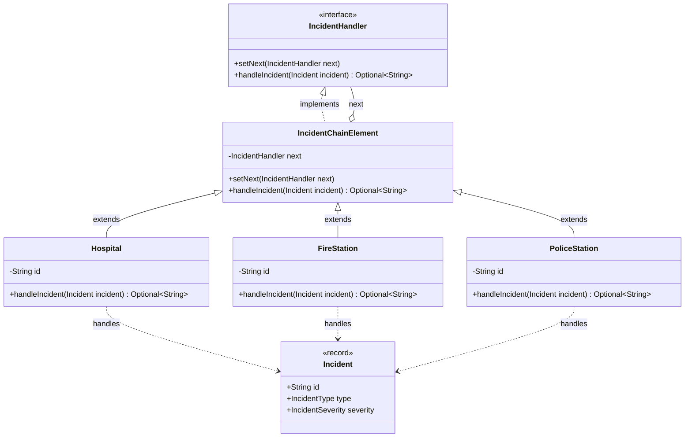

# Chain of Responsibility

The chain of responsibility design pattern allows multiple respondents to handle a command or event, without a central controller
having to manage the flow. Handlers are added to a chain, and either handle the event, or pass the responsibility to the next item.

While the name implies a linked list, the chain doesn't have to be a list. It can be a tree or forest, with every item that can
handle the event linking to a parent item. In that case the chain is the path from each leave or node to the root of the tree.

Typical use cases:
- Event handling in a UI: a component receives the event, and it bubbles up from child to parent, until it gets handled
- Authorization: The authorization request goes through a chain of rules, until one of them allows or rejects it

## Class Diagram

## This Implementation

In this example, emergency services (`Hospital`, `FireStation`, `PoliceStation`) form a chain that handles `Incident` requests.
Each handler decides whether it can respond to the incident based on its type and severity, and delegates to the next handler if not.

