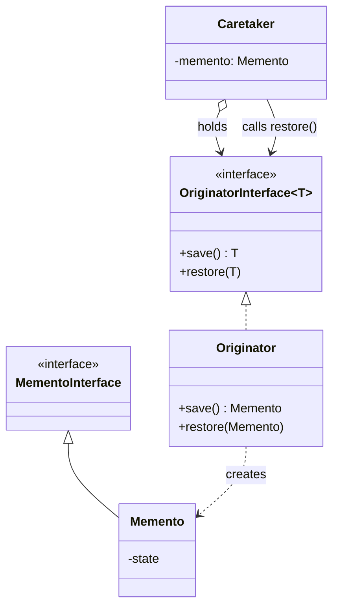
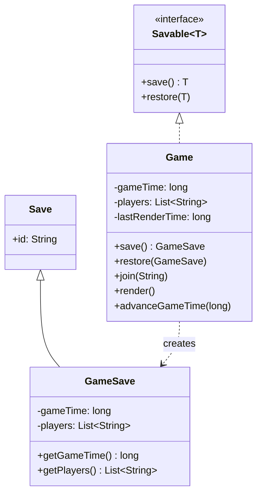

# Memento

The memento pattern captures and externalizes an object's internal state so it can be restored later, without violating encapsulation.

Typical use cases:
- Undo/redo: storing snapshots of editor state at each user action
- Game saves: checkpointing game state so the player can return to an earlier point
- Transactions: rolling back an object to a known-good state if an operation fails

## Class Diagram

## This Implementation

`Game` is the originator. It holds game state (`gameTime`, `players`) and transient state (`lastRenderTime`) that is deliberately excluded from saves. `GameSave` is the memento — an immutable snapshot of the saveable state, identified by a UUID from the `Save` base class. `Savable<T>` is a generic interface that formalises the originator contract. The caretaker role is played by the test, which holds a `GameSave` and decides when to restore it.

Note that `lastRenderTime` survives a restore unchanged, demonstrating that not all state needs to be captured — only what is meaningful to roll back.

