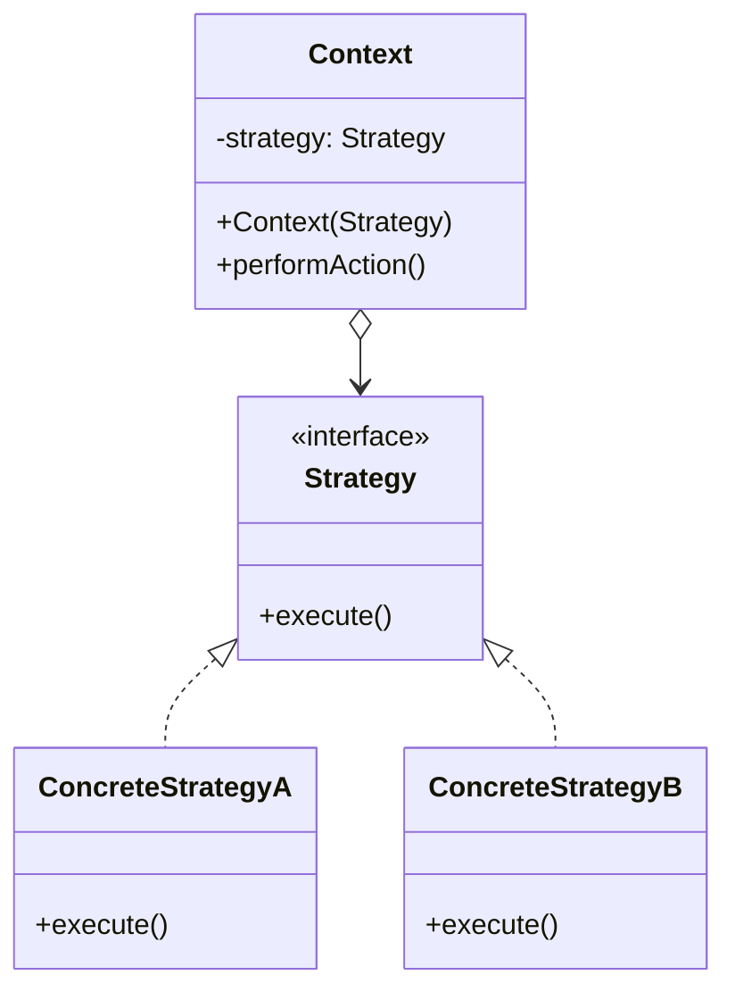
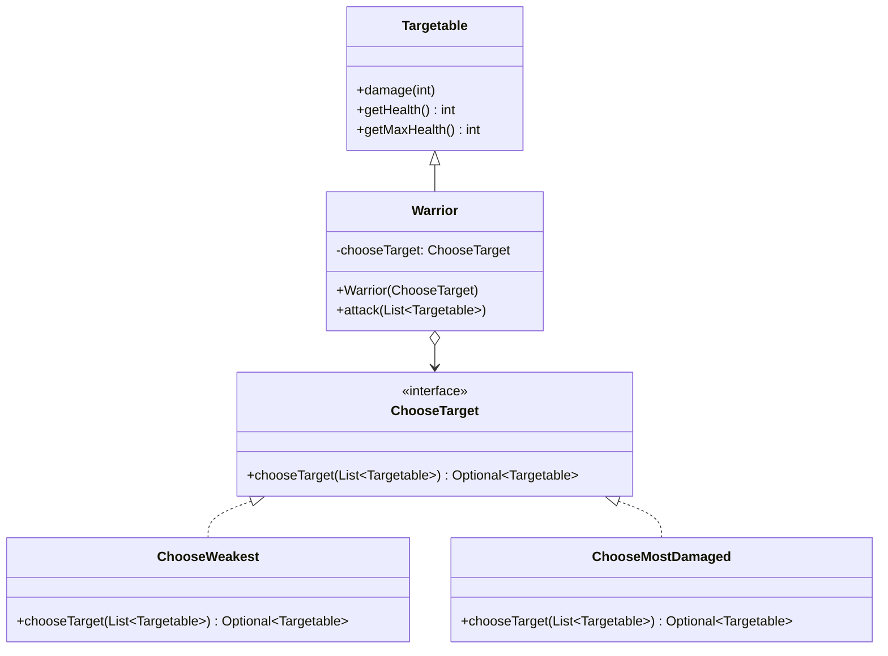

# Strategy

The strategy pattern defines a family of interchangeable algorithms behind a common interface, allowing the behavior of a context object to be selected or swapped at runtime without changing the context itself.

Typical use cases:
- Sorting: choosing between different sorting algorithms depending on data size or type
- Pathfinding: swapping between shortest-path, cheapest-path, or safest-path strategies
- Payment processing: selecting between credit card, PayPal, or bank transfer at checkout

## Class Diagram

## This Implementation

In this example, `Warrior` attacks enemies using a `ChooseTarget` strategy to select which enemy to hit. `ChooseWeakest` targets the enemy with the lowest health, while `ChooseMostDamaged` targets the one that has taken the most damage relative to its maximum health. `Targetable` is the base class for anything that can be targeted and damaged.

