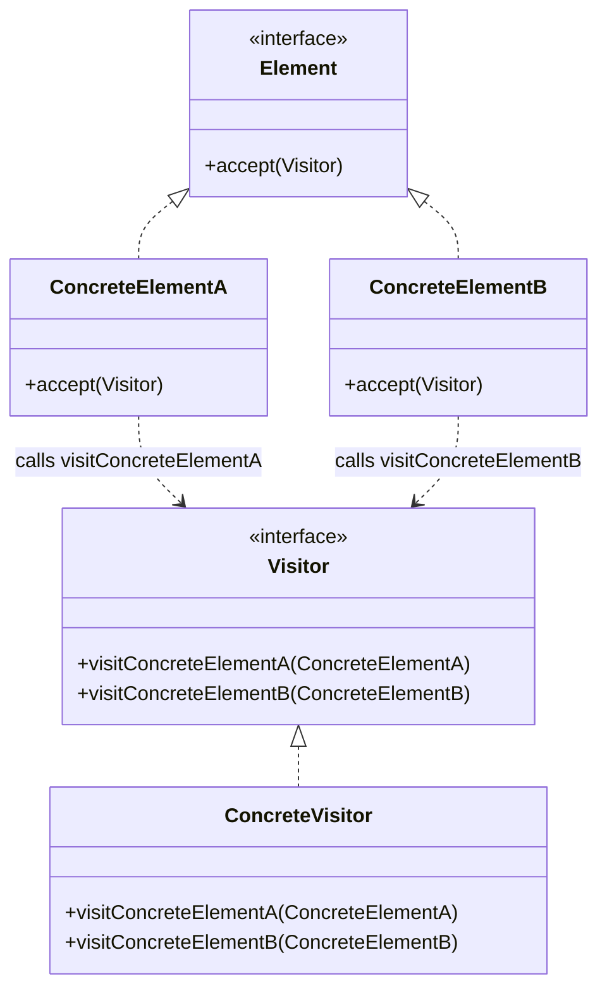
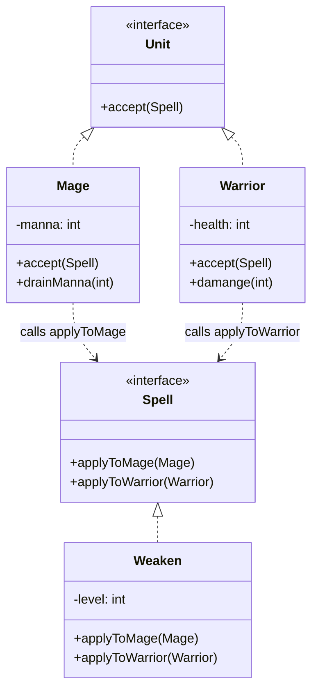

# Visitor

Visitors are used to execute functionality on every item of a data structure.
The benefit of the visitor pattern compared to just iterating over the data structure is that there's no instanceof logic in the visitor deciding what to execute based on the item type. This logic is in the items. This is also the downside: the items have to be aware of the visitor pattern.

Typical use cases:
- Exporting the data structure to a file.
- Bulk-editing all elements of a selection, ex highlighting units in a video game

## Class Diagram

## This Implementation

