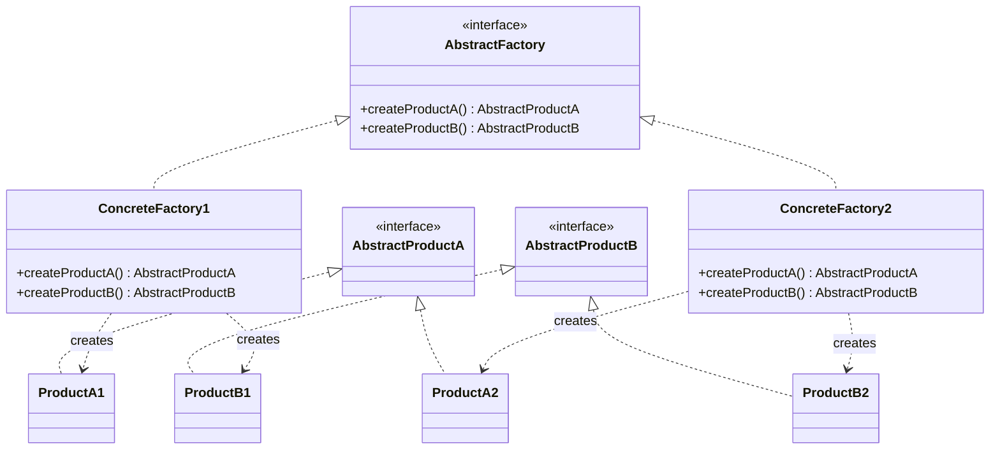
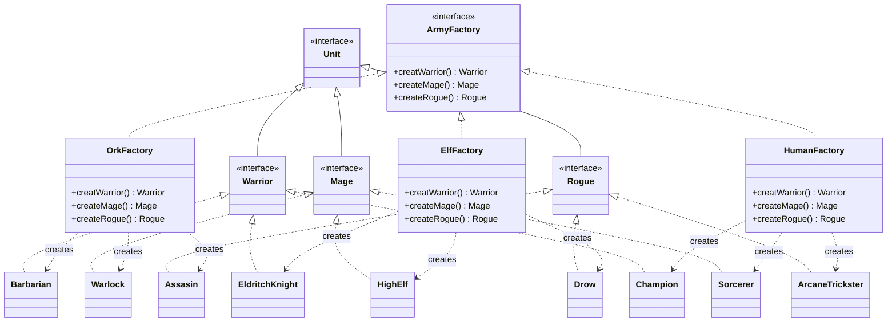

# Abstract Factory

The abstract factory pattern provides an interface for creating families of related objects, without specifying their concrete classes.
This guarantees that the created objects are compatible with each other.

Typical use cases:
- UI toolkits: a factory produces buttons, checkboxes, and dialogs all in the same theme (e.g. Windows vs macOS)
- Database access: a factory produces connections, commands, and transactions all for the same database vendor

## Class Diagram

## This Implementation

In this example, `ArmyFactory` produces a family of three unit types — `Warrior`, `Mage`, and `Rogue` — for each faction.
`OrkFactory`, `ElfFactory`, and `HumanFactory` each create a consistent set of faction-specific units.

