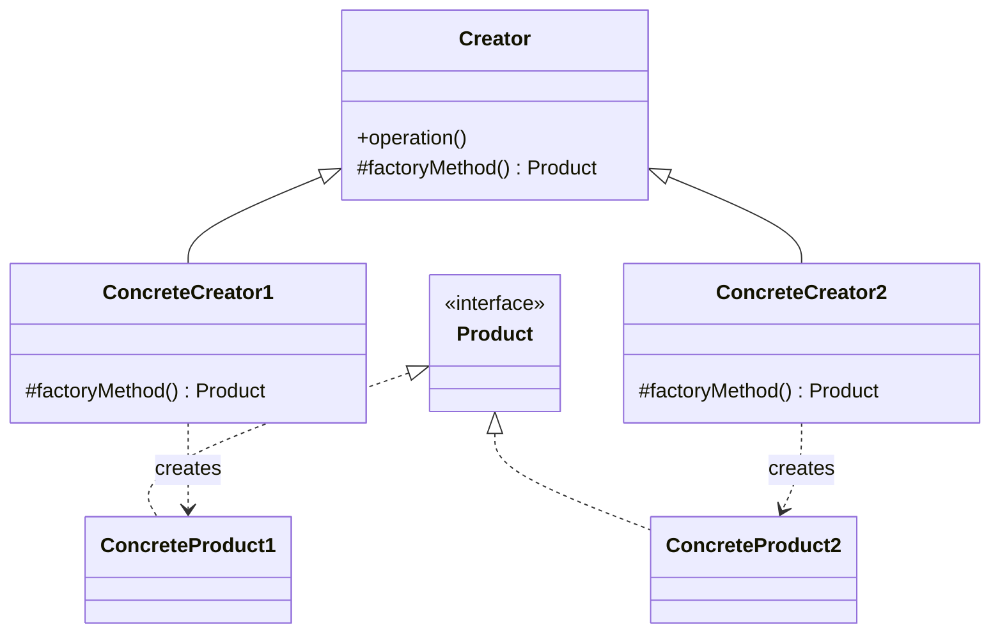
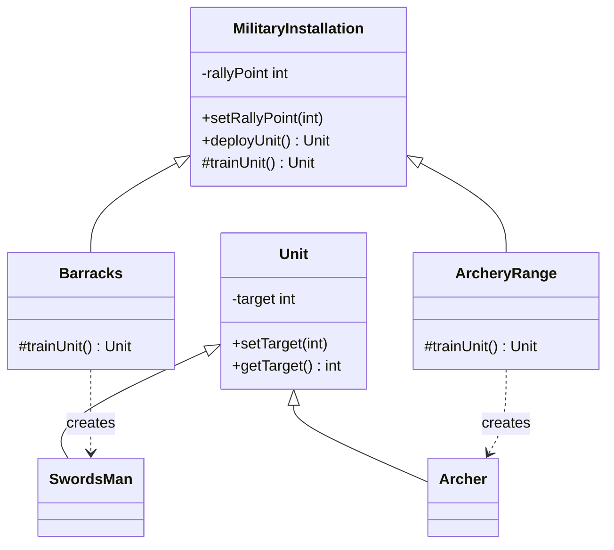

# Factory Method

The factory method pattern defines an interface for creating an object, but lets subclasses decide which class to instantiate.
It allows a class to defer instantiation to subclasses.

Typical use cases:
- Frameworks: a base class defines a workflow but lets subclasses plug in the concrete objects it operates on
- Logging: a base logger defines how messages are handled, subclasses decide the transport (file, console, network)

## Class Diagram

## This Implementation

In this example, `MilitaryInstallation` is the abstract creator that defines the `deployUnit()` workflow (setting the rally point on the trained unit).
Subclasses `Barracks` and `ArcheryRange` implement the factory method `trainUnit()` to produce a `SwordsMan` or `Archer` respectively.

