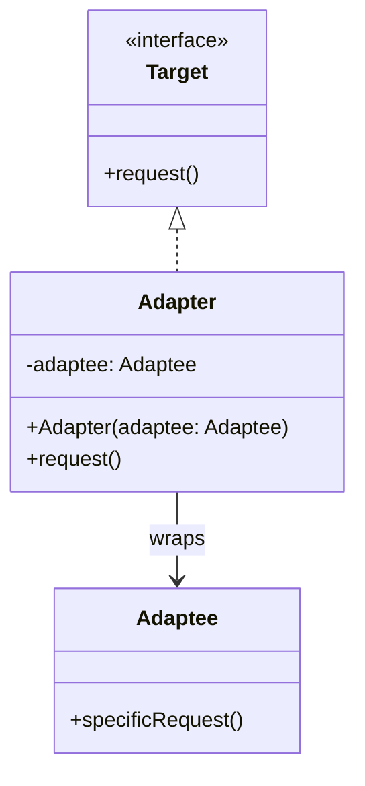
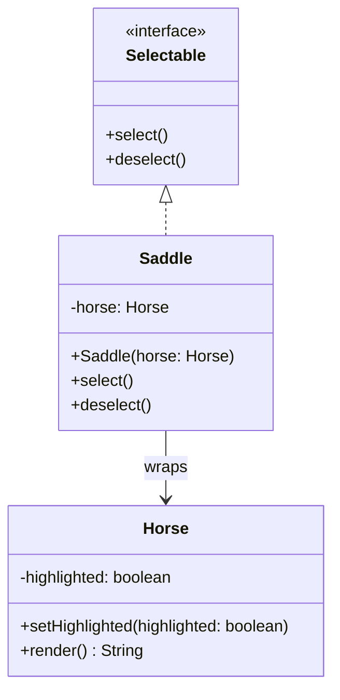

# Adapter

The adapter pattern converts the interface of an existing class into another interface that clients expect. It allows classes with incompatible interfaces to work together without modifying their source code.

Typical use cases:
- Integrating a third-party library whose interface doesn't match your application's expectations.
- Reusing legacy code that cannot be changed but needs to fit a new interface.

## Generic Class Diagram

## Example Class Diagram

