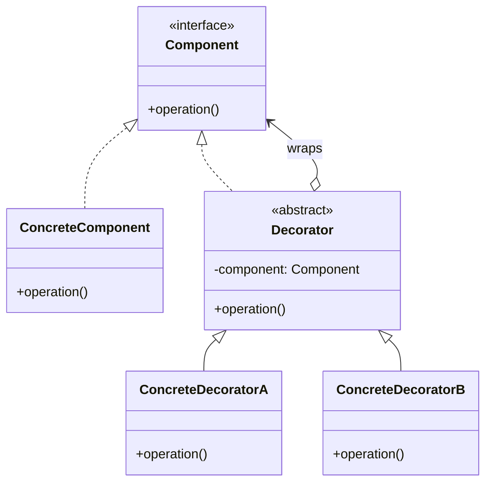
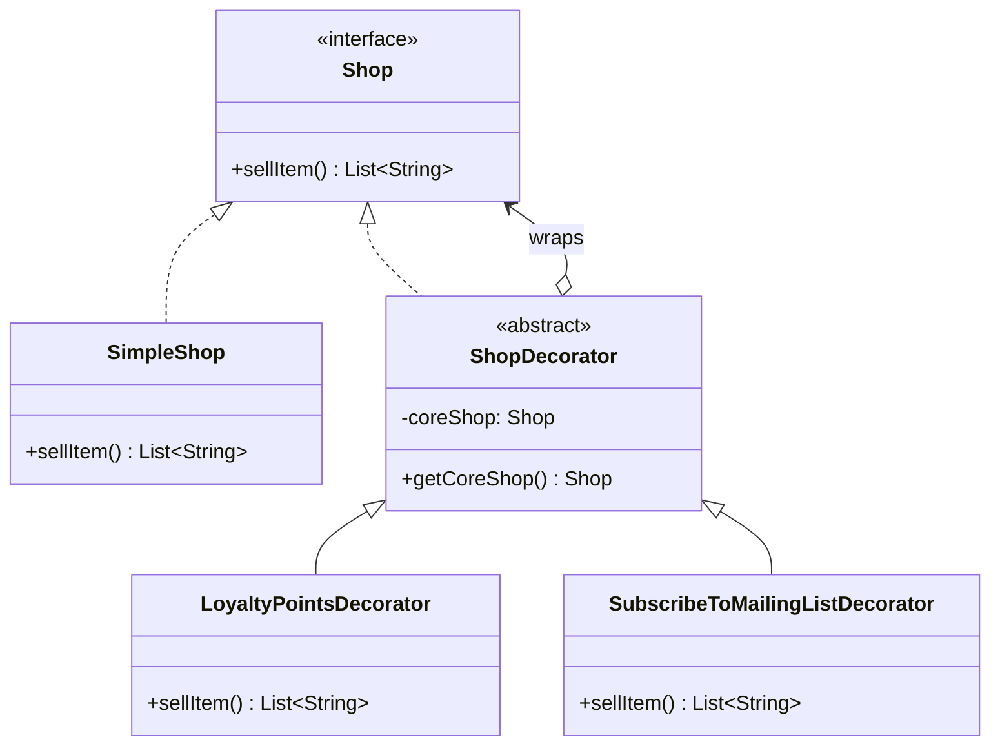

# Decorator

Decorators enhance the functionality of an object in runtime. They use composition to wrap the core object, and provide the same external interface, but enhanced behavior. But can work together too.

Typical use cases:
- Extending a class with logging.
- Adding checks to input parameters, validation of output ex in a chat bot.

## Generic Class Diagram

## Example Class Diagram

