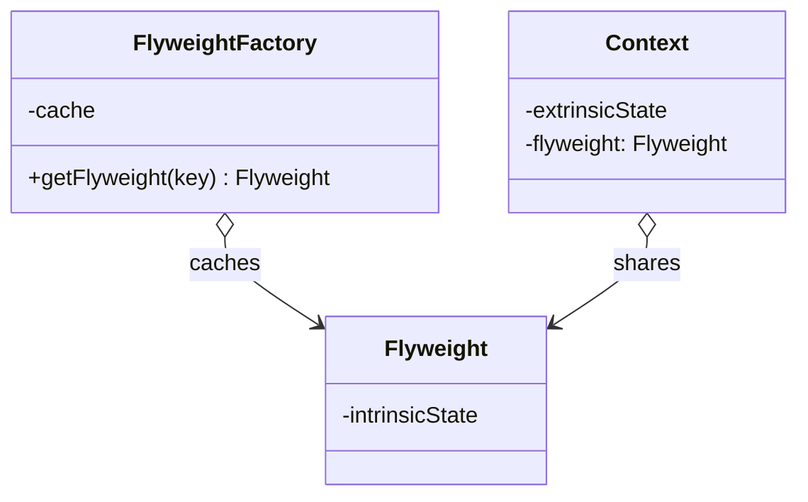
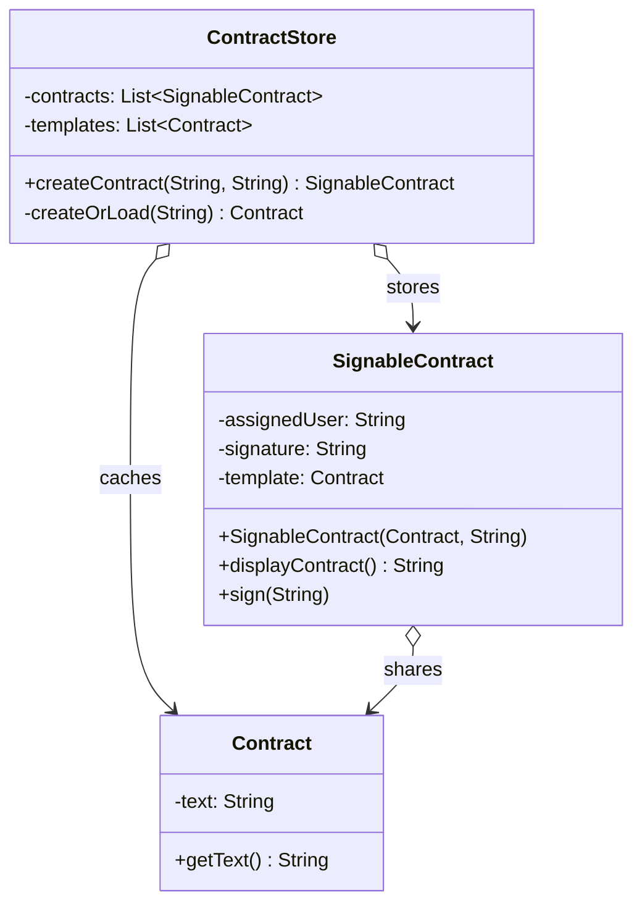

# Flyweight

The flyweight pattern reduces memory usage by sharing common state across many objects. Each object is split into intrinsic state (shared, immutable, stored in the flyweight) and extrinsic state (unique per instance, stored outside the flyweight).

A factory enforces sharing by caching flyweights and returning existing instances instead of creating new ones.

Typical use cases:
- Text rendering: sharing font/glyph objects across thousands of characters on screen
- Game entities: sharing sprite or mesh data across many instances of the same unit type
- Document templates: sharing contract or form text across many individually assigned copies

## Class Diagram

## This Implementation

`Contract` is the flyweight, holding the shared contract text. `SignableContract` is the context, holding the per-instance extrinsic state (`assignedUser`, `signature`). `ContractStore` acts as both the flyweight factory (via `createOrLoad`) and the document store.

